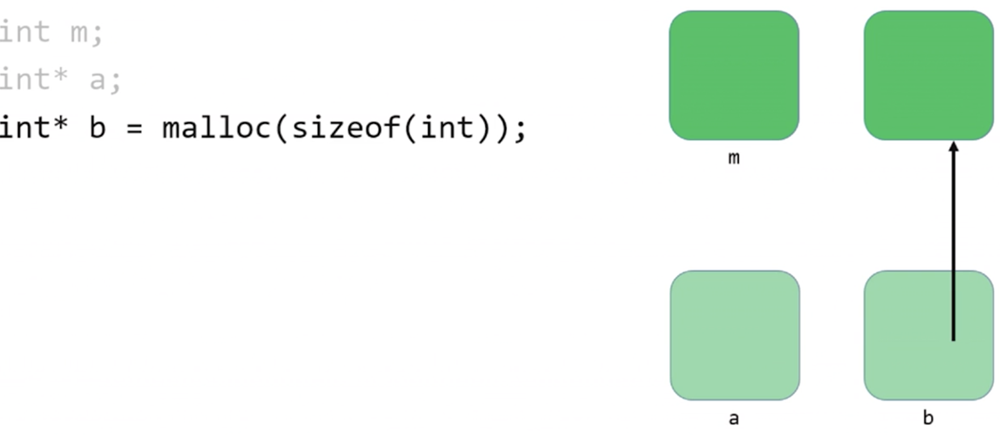

# Shorts 

Table of contents
 \=================
- [Hexadecimal](#hexadecimal)
- [Pointers](#pointers)
- [Defining Custom Types](#defining-custom-types)
- [Dynamic Memory Allocation](#dynamic-memory-allocation)
- [Call Stacks](#call-stacks)
- [File Pointers](#file-pointers)

## [Hexadecimal](https://youtu.be/u_atXp-NF6w) 

Most western cultures use the decimal system, aka base-10, to represent numeric data.

|1|2|3|4|5|6|7|8|9|
|-|-|-|-|-|-|-|-|-|

As we know, computers use the binary system, aka base-2, to represent numeric (and indeed all data).

|1|2|
|-|-|

As computer scientists, it's useful to be able to express data the same way the computer does.

The problem, of course, is that trying to parse a huge chain of 0s and 1s can be quite difficult. 

The **hexadecimal system**, aka base-16, is a much more concise way to express the data on a computer's system. 

|1|2|3|4|5|6|7|8|9|a|b|c|d|e|f|
|-|-|-|-|-|-|-|-|-|-|-|-|-|-|-|

Hexadecimal makes this mapping easy because a group of four binary digits (bits) has 16 different combinations, and each of these combinations maps to a single hexadecimal digit. 

Just like binary has place values (1, 2, 4, 8, ...) and decimal does too (1, 100, 1000, ...), so does hexadecimal.

|0x|3|7|9|
|-|-|-|-|
| |16^2|16^1|16^0|
| |256|16|1|

## [Pointers](https://youtu.be/XISnO2YhnsY)

- Pointers provide an alternative way to pass data between
  functions.
  - Recall that up to this point, we have passed all data by value, with
    one exception.
  - When we pass data by value, we only pass a copy of that data.
- If we use pointers instead, we have the power to pass the
  actual variable itself.
  - That means that a change that is made in one function can impact
    what happens in a different function.
    Previously, this wasn't possible!

### Memory 

- Every file on your computer lives on your disk drive, be it a
  hard disk drive (HDD) or a solid-state drive (SSD).
- Disk drives are just storage space; we can't directly work there.
  Manipulation and use of data can only take place in RAM, so
  we have to move data there.
- Memory is basically a huge array of 8-bit wide bytes.
  - 512 MB, 1GB, 2GB, 4GB...

|Data type|Size (in bytes)|
|---------|---------------|
|   int   |       4       |
|   char  |       1       |
|  float  |       4       |
|  double |       8       |
|long long|       8       |
|  char*  |     4 or 8    |

 

> Back to this idea of memory as a big array of byte-sized cells.
> - Recall arrays are useful for storage of information but also for so-called random access.
>   - We can access individual elements of the array by indicating which index location we want.    
> Similarly, each location in memory has an address.

 

There's only once critical thing to remember as  we start working with pointers :

 
 POINTERS ARE JUST ADDRESSES 

 

 

> - A pointer, then, is a data item whose  
>   - value is a memory address
>   - type describes the data located at that memory address     
> As such, pointers allow data structures and/or variables to be shared among functions.

  

> - The simplest pointer available to us in C is the NULL pointer.
>   - As you might expect, this pointer points to nothing (a fact which can actually come in handy!)    
> When you create a pointer and you don't set its value immediately, you should always set the value of the pointer to NULL.     
> You can check whether a pointer is NULL using the equality operator (==).

 

> - Another easy way to create a pointer is to simply extract the address of an already existing variable. We can do this with the address extraction operator (**&**).   
> - If x is an int-type variable, then &x is a pointer-to-int whose value is the address of x.
> - If arr is an array of doubles, then &arr[i] is a pointer-to double who value is the address of the ith element of arr.
>   - An array's name, then, is actually just a pointer to its first element - you've been working with pointers all along!

 

> The main purpose of a pointer is to allow us to modify or inspect the location to which it points.
>   - We do this by dereferencing the pointer.   
> - If we have a pointer-to-char called pc, then *pc is the data that lives at the memory address stored inside the variable pc.

 

> Used in this context, * is known as the dereference operator.  
> - It "goes to the reference" and accesses the data at that memory location, allowing you to manipulate it at will.   
 >- This is just like visiting your neighbor. Having their address isn't enough. You need to go to the address and only then can you interact with them.

 

> If we try to dereference a pointer whose value is NULL, we get a **segmentation fault**.   
> Surprisingly, this is actually good behavior! It defends against accidental dangerous manipulation of unknown pointers.
> - That's why we recommend you set your pointers to NULL immediately if you aren't setting them to a known, desired value.

 

> 
 
 int* p; 
 

> The value of p is an address.  
> We can dereference p with the * operator.  
> If we do, what we will find at the location is an int. 

 

> - One more annoying thing with those *s. They're an important part of both the type name and the variable name.
>   - Best illustrated with an example.  
> 

> 
<s>int* px, py, pz;</s>

> 
 int* pa, *pb, *pc;

> 

## [Defining Custom Types](https://youtu.be/crxfzK3Oc9M)

The C keyword *typede* provides a way to create a shorthand or rewritten name for data types. 

The basic idea is to first define a type in the normal way, then alias it to something else. 

typedef

&ltold name&gt

 &ltnew name&gt 

 

We can typdef a struct car and rename it car_t.   So instead of defining a car with **struct car car1**, we can just use **car car1**:

    

        
typedef

        
 struct 

        
 car 

    

    
 { 

    
 &nbsp; int year; 

    
 &nbsp; ... 

    
 } 

    
 car_t; 

## [Dynamic Memory Allocation](https://youtu.be/xa4ugmMDhiE)

We can use pointers to get access to a block of dynamically allocated memory at runtime.

Dynamically allocated memory comes from a pool of memory known as the heap.

Prior to this point, all memory we've been working with has been coming from a pool of memory known as the stack.

 

> We get this dynamically-allocated memory by making a call to the C standard library function malloc(), passing as its parameter the number of bytes requested.  
> After obtaining memory for you (if it can), malloc() will return a pointer to that memory.  
> What if malloc() can't give you memory? It'll hand you back NULL.

 

> Here's the trouble: Dynamically-allocated memory is not automatically returned to the system for later use when the function in which it's created finishes execution.  
> Failing to return memory back to the system when you're finished with it results in a memory leak which can compromise your system's performance.  
> When you finish working with dynamically-allocated memory, you must **free()** it.

 

> Three golden rules:
>  1. Every block of memory that you **malloc()** must subsequently be **free()d**.
>  2. Only memory that you **malloc()** should be **free()d**.
>  3. Do not **free()** a block of memory more than once.

 

## [Call Stacks](https://youtu.be/aCPkszeKRa4)

When you call a function, the system sets aside space in memory for that function to do its necessary work.  
We frequently call such chunks of memory **stack frames** or **function frames**.

More than one function's stack frame may exist in memory at a given time. If main () calls move(), which then calls direction (), all three functions have open frames.

 

> These frames are arranged in a **stack**. The frame for the most recently called function is always on the top of the stack.   
> When a new function is called, a new frame is **pushed** onto the top of the stack and becomes the active frame.    
> When a function finishes its work, its frame is **popped** off of the stack, and the frame immediately below it becomes the new, active, function on the top of the stack. This function picks up immediately where it left off.

## [File Pointers](https://youtu.be/bOF-SpEAYgk)

The ability to read data from and write data to files is the primary means of storing **persistent data**, data that does not disappear when your program stops running.

The abstraction of files that C provides is implemented in a data structure known as a FILE.  
Almost universally when working with files, we will be using pointers to them, FILE*.

 

> The file manipulation functions all live in stdio.h.
> - All of them accept FILE* as one of their parameters, except for the function fopen(), which is used to get a file pointer in the first place.  
> Some of the most common file input/output (1/0) functions that we'll be working with are: 

> |fopen()|fclose()|fgetc()|fputc()|fread()|fwrite()|
> |-------|--------|-------|-------|-------|--------|

 

>fopen()
> - Opens a file and returns a file pointer to it.
> -  Always check the return value to make sure you don't get back NULL.

  FILE* ptr = fopen(&ltfilename&gt, &ltoperation&gt);

> operation: r=read, w=write, a=append

 

>fclose()
> - Close the file pointed by the given file pointer.

  fclose(&ltfile pointer&gt);

 

>fgetc()
> - Reads and return the next character from the file pointed to.
> - Note: the operation of the file pointer passed in as a parameter must be "r" for read, or you will suffer an error.

  char ch = fgetc(&ltfile pointer&gt);

 

The ability to get single characters from files, if wrapped in a loop, means we could read all the characters from a file and print them to the screen, one-by-one, essentially.

    
 char ch; 

    
 while((ch = fgetc(ptr)) != EOF) 

    
 &nbsp; printf("%c",ch); 

 

>fputc()
> - Writes or appends the specified character to the pointed file.
> - Note: the operation of the file pointer passed in as a parameter must be "w" for write or "a" for append, or you will suffer an error.

  fputc(&ltcharacter&gt,&ltfile pointer&gt);

 

We can copy one file to anothern using fgetc() and fputc().

    
 char ch; 

    
 while((ch = fgetc(ptr)) != EOF) 

    
 &nbsp; fputc(ch,ptr2); 

 

>fread()
> - Reads \<qty> units of size \<size> from the file pointed to and stores them in memory in a buffer (usually an array) pointed to by \<buffer>.
> - Note: the operation of the file pointer passed in as a parameter must be "r" for read, or you will suffer an error.

  fputc(&ltbuffer&gt,&ltsize&gt,&ltqty&gt,&ltfile pointer&gt);

 

>fwrite()
> - Writes \<qty> units of size \<size> from the file pointed to by reading them from a buffer (usually an array) pointed to by \<buffer>.
> - Note: the operation of the file pointer passed in as a parameter must be "w" for write or "a" for append, or you will suffer an error.

  fwrite(&ltbuffer&gt,&ltsize&gt,&ltqty&gt,&ltfile pointer&gt);

 

Lots of other useful functions abound in stdio.h. Here are some:
