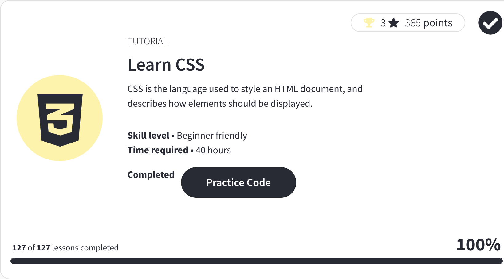
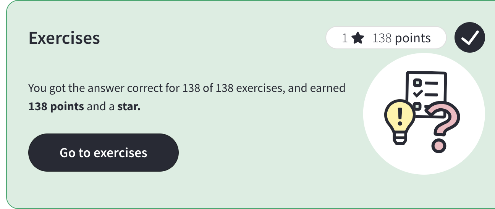
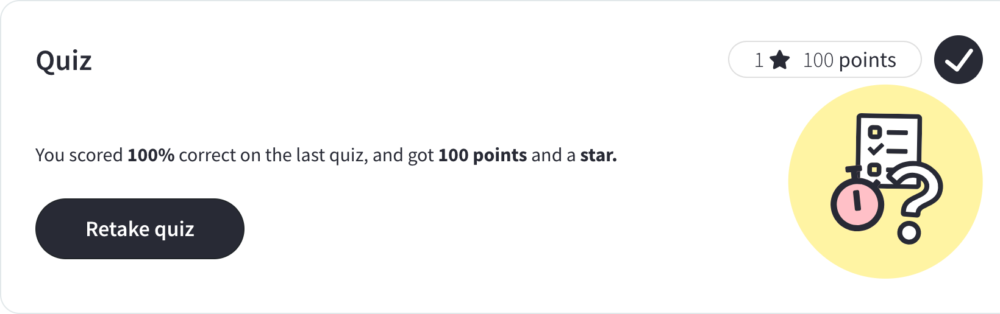

# [W3C](https://www.w3schools.com/css/)

## [LearnCSS](https://my-learning.w3schools.com/tutorial/css)

## Exercices

## Quiz

## [Certification](https://campus.w3schools.com/collections/course-catalog/products/css-course)

<pre>
Exam fee:	$95.00
Number of questions: 70
Requirement to pass: 75% correct answers
Time limit: 70 minutes
Number of attempts to pass: Three
Exam deadline: None
Certification Expiration: None
Format: Online, multiple choice
</pre>