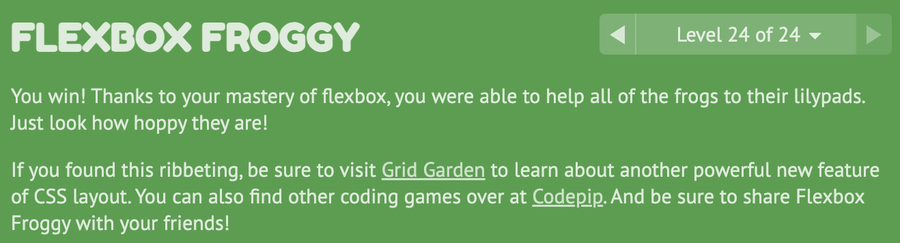

# [FLEXBOX FROGGY](https://flexboxfroggy.com/)

## justify-content : Aligns flex items along the main axis.
flex-start (default) flex-end center space-between space-around space-evenly

- flex-start: Items align to the left side of the container.
- flex-end: Items align to the right side of the container.
- center: Items align at the center of the container.
- space-between: Items display with equal spacing between them.
- space-around: Items display with equal spacing around them.

## align-items : Aligns flex items along the cross axis.
flex-start flex-end center baseline stretch (default)

- flex-start: Items align to the top of the container.
- flex-end: Items align to the bottom of the container.
- center: Items align at the vertical center of the container.
- baseline: Items display at the baseline of the container.
- stretch: Items are stretched to fit the container.

## flex-direction: Defines the direction of the main axis.
row (default) row-reverse column column-reverse

- row: Items are placed the same as the text direction.
- row-reverse: Items are placed opposite to the text direction.
- column: Items are placed top to bottom.
- column-reverse: Items are placed bottom to top.

## order : Specifies the order of the flex item.
<integer> (... -1, 0 (default), 1, ...)

## align-self : Aligns a flex item along the cross axis, overriding the align-items value.
flex-start flex-end center baseline stretch

## flex-wrap : Specifies whether flex items are forced on a single line or can be wrapped on multiple lines.
nowrap (default) wrap wrap-reverse

- nowrap: Every item is fit to a single line.
- wrap: Items wrap around to additional lines.
- wrap-reverse: Items wrap around to additional lines in reverse.

## flex-flow : Shorthand property for flex-direction and flex-wrap.
<flex-direction> <flex-wrap>

## align-content : Aligns a flex container's lines within the flex container when there is extra space on the cross-axis.
flex-start flex-end center space-between space-around space-evenly stretch (default)

- flex-start: Lines are packed at the top of the container.
- flex-end: Lines are packed at the bottom of the container.
- center: Lines are packed at the vertical center of the container.
- space-between: Lines display with equal spacing between them.
- space-around: Lines display with equal spacing around them.
- stretch: Lines are stretched to fit the container.

