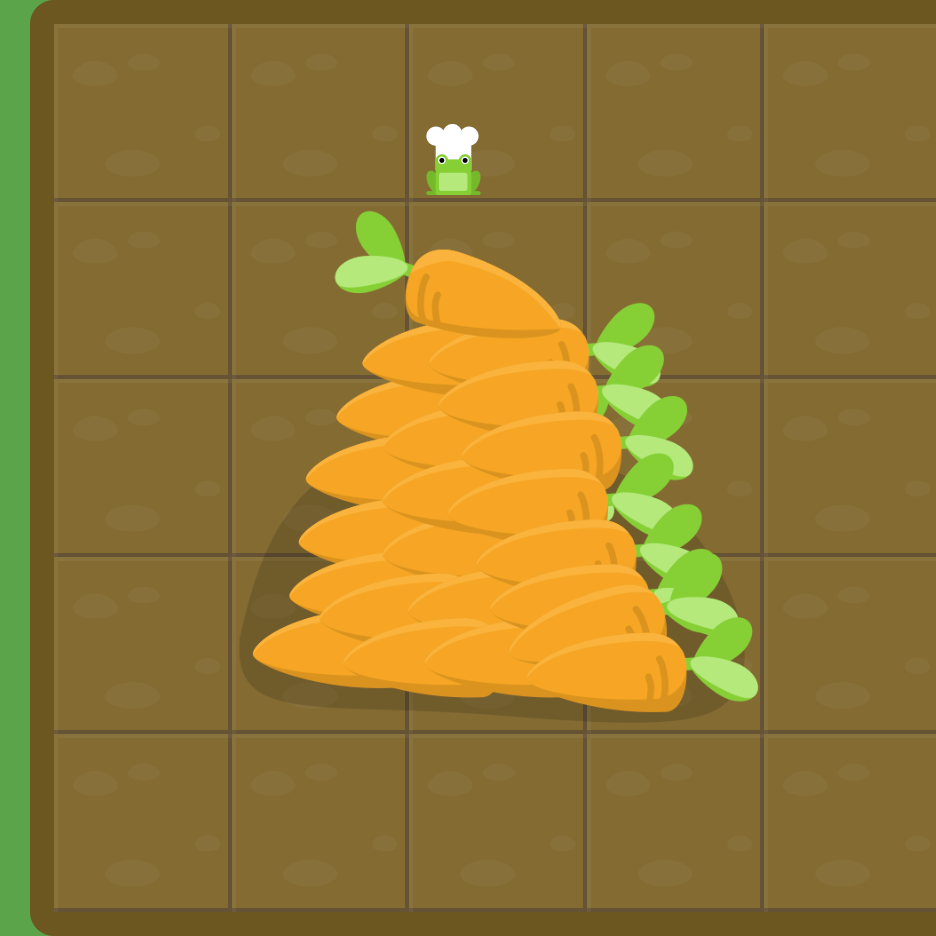

# [Grid Garden](https://cssgridgarden.com/#fr)

## grid-column-start
Définit la position du début d'un élement de la grille sur les colonnes de la grille.
<integer> span <integer>

## grid-column-end
Définit la position de fin d'un élement de la grille sur les colonnes de la grille. 
<integer> span <integer>

## grid-column 
Définit la position d'un élément de la grille sur les colonnes de la grille 
<grid-column-start> / <grid-column-end>

## grid-row-start 
Définit la position du début d'un élément sur les lignes de la grille 
<integer> span <integer>

## grid-row
Définit la position d"un élement sur la grille sur les lignes de la grille
<grid-row-start> / <grid-row-end>

## grid-area
Définit la position et la taille d'un élément dans la grille 
<grid-row-start> /  <grid-column-start> / <grid-row-end> / <grid-column-end> 

## order 
Définit l'ordre de l'élement dans la grille 
<integer>

## grid-template-columns
Définit le dimensionnement et les noms des colonnes de la grille 
<length> <percentage> <flex> max-content min-content minmax(min,max)

## grid-template-rows
Définit le dimensionnement et les noms des lignes de la grille 
<length> <percentage> <flex> max-content min-content minmax(min,max)

## grid-template
Définit le dimensionnement et les noms des lignes et des colonnes de la grille 
<grid-template-rows>/ <grid-template-columns>

## Completion
