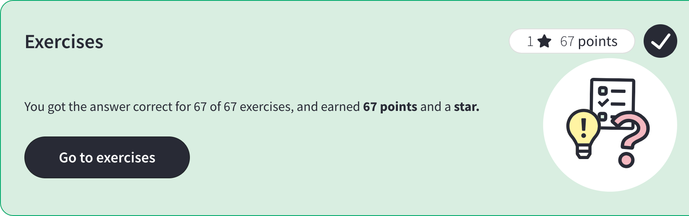

# [W3C](https://my-learning.w3schools.com/tutorial/js)

## [LearnHTML](https://www.w3schools.com/js/)

## Exercices

## Quiz

## [Certification](https://campus.w3schools.com/products/javascript-course)

<pre>
Exam fee:	$95.00
Number of questions: 70
Requirement to pass: 75% Correct answer
Time limit: 70 minutes
Number of attempts to pass: Three
</pre>